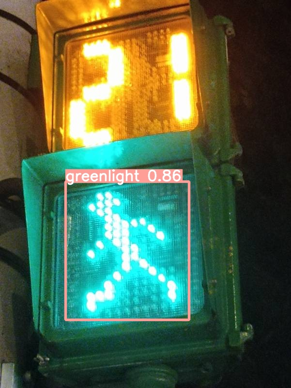
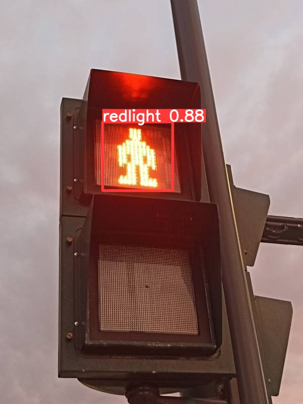

# Vision-Assist-YOLO: Traffic Light & Crosswalk Detection

## Project Overview
This project aims to assist visually impaired individuals in safely navigating intersections using Deep Learning. By leveraging the **YOLOv5** object detection model, the system can identify red lights, green lights, and zebra crossings in real-time through a simple webcam setup.

## Tech Stack
* **Deep Learning Framework:** PyTorch, YOLOv5
* **Language:** Python
* **Tools:** OpenCV, LabelImg (for annotation), Jupyter Notebook (for training)

## Dataset & Preprocessing
To ensure the model performs well in real-world scenarios in Taiwan, a custom dataset was collected and processed:
* **Collection:** Gathered 186 street-view images of Taiwanese traffic lights and zebra crossings.
* **Annotation:** Manually annotated the images using LabelImg with three specific classes: `redlight`, `greenlight`, and `zebralines`.
* **Processing:** Split the dataset into 80% training data (148 images) and 20% validation data (38 images).

## Model Performance
The model achieved high precision during validation, particularly in identifying traffic lights:
* **Red Light:** Precision 0.972 / Recall 1.0
* **Green Light:** Precision 0.990 / Recall 1.0
* **mAP@0.5:** 0.898

### Detection Demos
*(Below are real-time detection results from the project)*

<p float="left">
  
  
</p>

## 📂 Repository Structure
```text
Vision-Assist-YOLO/
├── docs/                                # Project documentation and demo images
│   ├── Presentation_EN.pdf              # Project presentation slide deck
│   ├── Summary_EN.pdf                   # Executive summary of the research
│   ├── demo_green.jpg                   # Demo screenshot (Green light)
│   └── demo_red.jpg                     # Demo screenshot (Red light)
├── src/                                 # Source code for data pipeline
│   └── traffic_light_detection.ipynb    # Script for dataset splitting and training
└── README.md                            # Project description
```

## Acknowledgments
* The base YOLO training pipeline and Colab environment setup were adapted from the open-source tutorial provided by J.-T. Huang (dataset_traffic_sign.ipynb).
* We extended this pipeline by building a custom dataset and evaluating its feasibility for assisting visually impaired pedestrians.